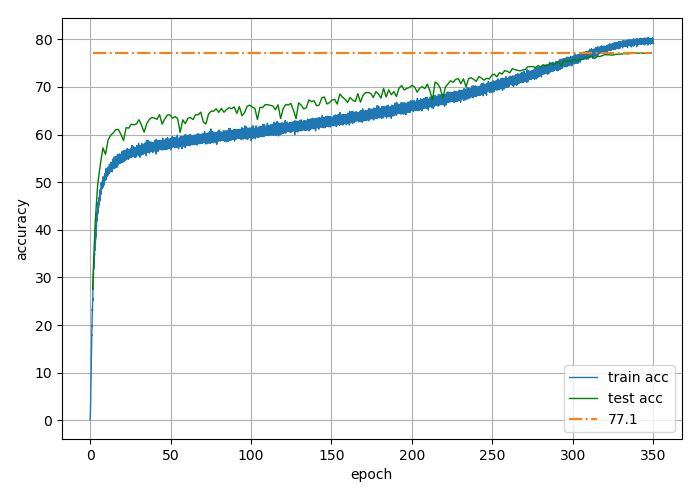

# BetaNAS
Materials for BetaNAS

* BetaNAS-A + SE + swish + autoaugment, flops=631M, accuracy=79.0
      - learning rate 1.4; weight decay 2e-5; label smooth 0.1; dropout rate 0.2; drop connection rate 0.2; batch size per gpu 64; num gpu 32 (distributed).
      
      

* BetaNAS-A, flops=596M, accuracy=77.1
      - learning rate 1.4; weight decay 2e-5; label smooth 0.1; dropout rate 0.2; batch size per gpu 64; num gpu 32 (distributed).

* BetaNAS-A, flops=315M, accuracy=75.1
      - learning rate 1.4; weight decay 2e-5; label smooth 0.1; dropout rate 0.2; batch size per gpu 64; num gpu 32 (distributed).
      

* BetaNAS-B, accuracy=75.8
      - learning rate 1.4; weight decay 2e-5; label smooth 0.1; dropout rate 0.2; batch size per gpu 64; num gpu 32 (distributed).
      
